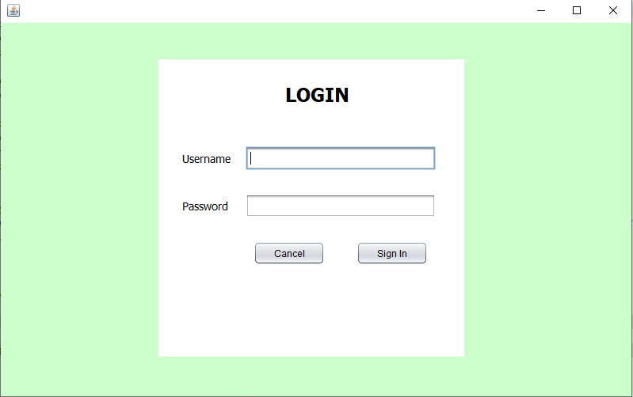
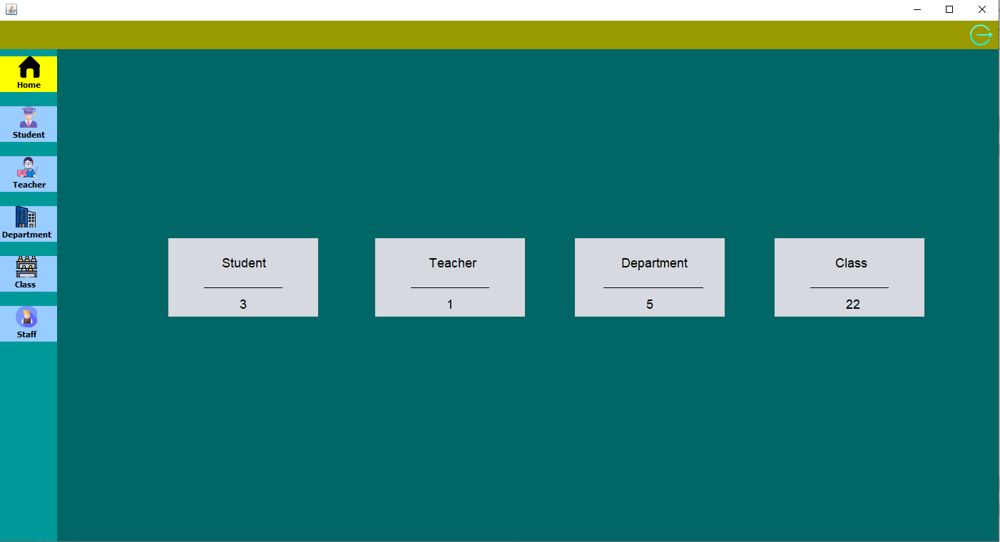
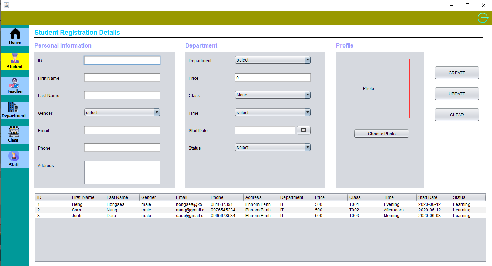
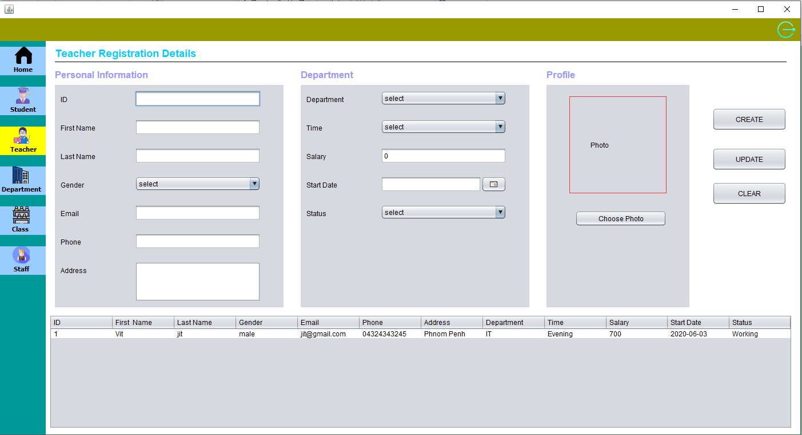
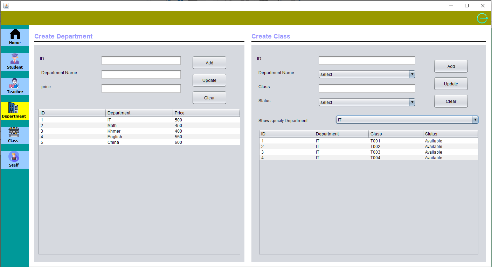
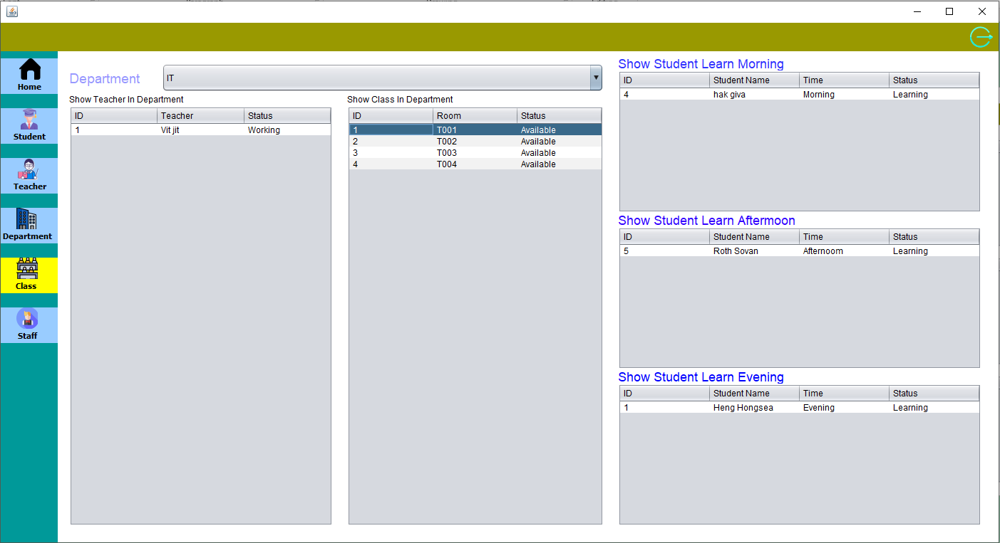
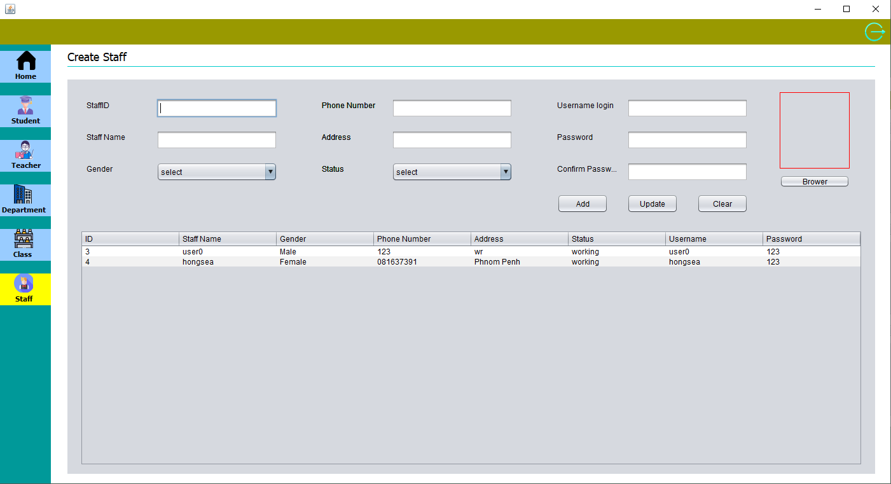

```
Title: Student Registration system
Author: Heng Hongsea
Status: Active
Create: June-18-2020
Updat: July-03-2020
Version: 0.1.0
```

# STUDENT REGISTRAION SYSTEM

## Software and Hardware Requirement

### Software

* Apache Netbeans IDE 12.0
* JDK8
* SQL Server

### Hardware

* CPU core i3 2.4 GHZ
* RAM 4GB
* HDD 20GN

## How to setup this project

You need download Apache Netbeans IDE 12.0 and Setup SQL Server

1. Setup SQL Server

In folder `sql` you will see `sql_dev.sql` and you need import it to sql server. You will see Database and table that we use is:
 
```
Database: dev_SRD
Table: tbstudent, tbteacher, tbdepartments, tbclass, tbstaff
```
  
2. Setup this project
  
Open `Apache Netbeans IDE 12.0` and Open this project. You need to change username and password for connect to SQL Database in `Login Form` . And then run Login Form and login username `admin` and password `admin`.


* **Login Form**



* **Home Form**



* Student Registration Form



* **Teacher Form**




* **Department Form**




* **Class Form**




* **Staff Form**




